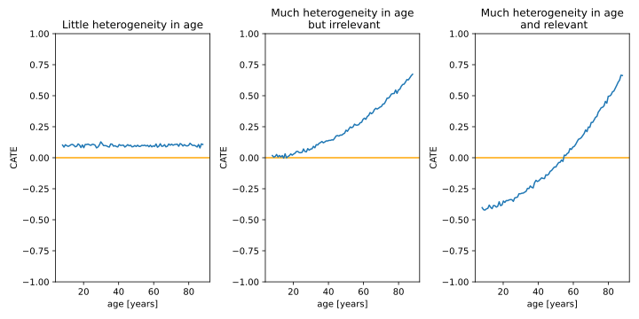

Background
==========

CATE estimation
---------------

This library is all about MetaLearners and MetaLearners are a popular
choice to estimate CATEs. Therefore, we will discuss what CATEs are as
well as when and how they can be useful.

What are CATEs?
"""""""""""""""

CATEs, short for Conditional Average Treatment Effects, are a concept
from the field of Causal Inference. They rely on the `potential
outcomes framework <https://web.archive.org/web/20150513202106/http://sekhon.berkeley.edu/papers/SekhonOxfordHandbook.pdf>`_ proposed by Rubin and Neyman.

Potential outcomes
******************

If, for instance, two treatment variants  can be chosen --
i.e. :math:`W \in \{0, 1\}` -- said
potential outcomes framework defines the potential outcomes
:math:`Y(1)` and :math:`Y(0)` both indicating the outcome
if the respective treatment variant had been chosen. The notion of
these potential outcomes generalizes to a scenario with :math:`K > 2`
treatment variants where :math:`W \in \{0, \dots, K-1\}`

Gven these potential outcomes per treatment variant, we can
investigate the pairwise differences of the potential outcomes to
define the notion of treatment effects.

Treatment effects
*****************

If we think of :math:`Y(1)` as the outcome if we had chosen treatment
variant 1 and :math:`Y(0)` as the outcome if we had chosen treatment
variant 0, it follows naturally that the difference of both
:math:`Y(1) - Y(0)` quantifies the impact on the outcome of the treatment
1 compared to treatment 0. This quantity is often referred to as a
treatment effect.

More concretely, these treatment effects can be defined for several
levels of granulariy. Assuming treatment variants 1 and 0 we
distinguish the following:

* The **Individual Treatment Effect** is the treatment effect of one
  treatment variant compared to another variant on a particular experiment unit
  :math:`i`, e.g. :math:`\tau^i = Y^i(1) - Y^i(0)`.

* The **Conditional Average Treatment Effect** is an expected treatment
  effect conditioning on covariates :math:`X`: :math:`\tau(X) =
  \mathbb{E}[Y(1) - Y(0)|X]`. Since the CATE conditions on covariates,
  it is able to capture heterogeneity of the treatment effect,
  In other words, it captures for which instantiations of :math:`X` the treatment effect is
  higher and for which it is lower.

* The **Average Treatment Effect** is an expected treatment effect, not
  conditioning on covariates: :math:`\tau(X) = \mathbb{E}[Y(1) -
  Y(0)]`.

CATE estimation is not supervised learning
""""""""""""""""""""""""""""""""""""""""""

MetaLearners rely on off the shelf supervised Machine Learning models
to estimate CATEs. Yet, regular supervised learning problems,
i.e. regression an classification problems, come with labels. Thanks
to these labels said
Machine Learning models can learn a function fitting features or
covariates :math:`X` to outcomes :math:`Y`. In an ideal world we could
do the same for CATE estimation by replacing :math:`Y` with the
individual treatment treatment effect :math:`\tau^i` from above.

The fundamental problem of Causal Inference
*******************************************

Let's illustrate why doing just that isn't quite as easy with an example.

Imagine we have 3 experiment participants, i.e. experiment units,
Susan, Judea and Victor. Now we would like to figure out the treatment
effect of making them listen to Bach, :math:`W = 1`, compared to not
making them listen to Bach, :math:`W=0`, on their joyfulness
:math:`Y`. There are two covariates that we can base our heterogeneity
on:

* their age
* whether they are a musician themselves or not

In an ideal world we'd observe both :math:`Y^i(1)` and :math:`Y^i(0)` and
could therefore compute :math:`\tau^i` for each unit, see the table below.

.. list-table:: Dataset in an ideal world
   :header-rows: 1

   * - unit :math:`i`
     - age :math:`x_1^i`
     - is_musician :math:`x_2^i`
     - :math:`Y^i(0)`
     - :math:`Y^i(1)`
     - :math:`\tau^i`
   * - Susan
     - 28
     - 1
     - .6
     - .8
     - .2
   * - Judea
     - 37
     - 1
     - .5
     - .6
     - .1
   * - Victor
     - 42
     - 0
     - .9
     - .6
     - -.3

If we did indeed have access to this data, we could train a regressor
mapping :math:`X` to :math:`\tau`, thereby estimating the CATE.

Yet, in reality, we never have access to several potential outcomes at once. We
can, for instance, make Susan listen to Bach for a while and then not
listen to Bach and measure her joyfullness during each period. Yet,
these periods are not perfectly equivalent; maybe she's more tired during
one of the periods; maybe she still draws from the joys of
listening to Bach when not listening to Bach anymore. This aspect of
only ever having access to one of the potential outcomes is referred
to as the fundamental problem of Causal Inference.

As a consequence of this problem, data from a real-world experiment
would rather look as such:

.. list-table:: Dataset in the real world
   :header-rows: 1

   * - unit :math:`i`
     - age :math:`x_1^i`
     - is_musician :math:`x_2^i`
     - treatment :math:`W^i`
     - :math:`Y^i(0)`
     - :math:`Y^i(1)`
     - :math:`\tau^i`
   * - Susan
     - 28
     - 1
     - 1
     - ?
     - .8
     - ?
   * - Judea
     - 37
     - 1
     - 0
     - .5
     - ?
     - ?
   * - Victor
     - 42
     - 0
     - 1
     - ?
     - .6
     - ?

Note that there is one treatment assignment :math:`W^i` for each unit
and only the outcome linked to this treatment variant can be observed.

Hence, CATE estimation is not a regular supervised learning problem.

.. _how-can-cates-be-useful:

How can CATEs be useful?
""""""""""""""""""""""""

CATEs can be very useful to quantify how well past treatment assignment
mechanisms have been doing in light of a given outcome. Yet, they can
also be used to prescribe a way of intervening in a forward-looking
manner. This 'way of intevening' we call a policy.

More precisely, we define a policy as a mapping from the covariate space
:math:`\mathcal{X}` to the set of treatment variants. The set of
treatment variants is also referred to as action space, set of arms
or option space in other frameworks. Note that a policy could also be
probabilistic, i.e. a distribution over treatment variants given
covariates. We care about deterministic policies only.

Learninig a policy
******************

If one is given CATE estimates :math:`\tau_{k}(X^i)`, i.e. quantifications of the effect of
certain treatment variants on the outcome, compared to other treatment
variants for fixed covariates, an optimal policy :math:`\pi` can be trivially
defined:

.. math::
   \pi(X^i) := \arg\max_k \tau_{k}(X^i)

As a consequence, when encountering 'new' data, which hasn't been used
for learning a CATE model, we can apply our CATE model on it and
assess what treatment variant it should receive.

When can CATEs be useful?
"""""""""""""""""""""""""

As was described before, CATEs lend themselves fairly naturally to
use cases where

* there is a notion of a treatment, intervention or action
* one suspects the treatments to behave heterogeneously with respect
  to some covariates
* the heterogeneity crosses a decision boundary

In the following image we see some CATE estimates for an intervention
based on a single covariate age.

We see that in the left image, there is fairly little heterogeneity in
the CATE estimates with respect to age. The second image conveys the
presence of a lot of heterogeneity of the treatment with respect to
age. Yet, this heterogeneity is not relevant in light of a policy
definition since all estimates are on 'one side' of the decision
boundary, here chosen to be 0. The third picture, on the other hand,
illustrates a scenario where heterogenity can be leveraged for policy
learning: in some regions the CATE is negative and therefore treatment
variant 0 to be preferred over treatment variant 1 -- in other region
the opposite holds true.

We would like to learn such policies to apply them on previously
unseen data. In order to learn the policy, we can use data from an experiment.
We can dinstinguish two cases when it comes to experiment data:
:term:`observational<Observational data>` or
:term:`RCT<Randomized Control Trial (RCT)>` data.

Importantly, MetaLearners for CATE estimation can, in principle, be
used for both observational or RCT data. Yet, the following conditions
need to be validated in order for the MetaLearners to produce valid
estimates:

* Positivity/overlap

.. math::
   \forall k: \Pr[W=k|X] > 0

* Conditional ignorability/unconfoundedness

.. math::
   \forall k', k''\ s.t.\ k' \neq k: (Y(k'), Y(k'')) \perp W | X

* Stable Unit Treatment Value

.. math::
   \forall k: W = k \Rightarrow Y = Y(k)

where :math:`k` represent a treatment variant. If the experiment data stems from a RCT, the first two conditions are
already met. For more details see `Athey and Imbens (2016) <https://arxiv.org/pdf/1607.00698>`_.

MetaLearners
------------
Following the definition by `Kunzel et al. <https://doi.org/10.1073/pnas.1804597116>`_, MetaLearning
refers to any technique where a functional learning problem is decomposed into a sequence of
simpler learning tasks.

There maybe several theoretical or practical reasons to prefer one CATE decomposition over
another, which is why so many CATE metalearners have been developed. Most of them are
developed for the binary treatment case although extensions to the multiple discrete
treatments can be implemented. In this library we assume we have :math:`K` treatment
variants including the control variant, i.e. :math:`w \in \{0,\dots,K-1\}`. Given this scenario,
we estimate the CATE for each variant in relation to the control:

.. math::
    \tau_k(x) := \mathbb{E}[Y(k) - Y(0) | X=x] \; \forall k \in \{1,\dots, K-1\}

S-Learner
"""""""""""""""""""""
The S-Learner was introduced by `Kuenzel et al. (2019) <https://arxiv.org/pdf/1706.03461.pdf>`_.
In this case the treatment indicator is included as a feature similar to all other features
and estimating the combined response function:

.. math::
    \mu (x, w) := \mathbb{E}[Y | X = x, W=w]

using any base learner.

Then the CATE is estimated as:

.. math::
    \hat{\tau}^S(x) := \hat{\mu}(x,1) - \hat{\mu}(x,0)

More than binary treatment
**************************

In the case of multiple discrete treatments the treatment variant is encoded in one
column if the model natively supports categorical variables or one-hot-encoded if it does
not have native support.

The CATE for each treatment variant against the control is then estimated with:

.. math::
    \hat{\tau}_k^S(x) = \hat{\mu}(x,k) - \hat{\mu}(x,0) \; \forall k \in \{1,\dots, K-1\}

T-Learner
"""""""""""""""""""""
The T-Learner was introduced by `Kuenzel et al. (2019) <https://arxiv.org/pdf/1706.03461.pdf>`_.
In the T-Learner the conditional average outcomes are estimated using one estimator for
each treatment variant:

.. math::
    \mu_0 (x) &:= \mathbb{E}[Y(0) | X = x] \\
    \mu_1 (x) &:= \mathbb{E}[Y(1) | X = x]

:math:`\hat{\mu}_0` and :math:`\hat{\mu}_1` are estimated using the untreated and treated observations
respectively.

Then the CATE is estimated as:

.. math::
    \hat{\tau}^T(x) := \hat{\mu}_1(x) - \hat{\mu}_0(x)

More than binary treatment
**************************

In the case of multiple discrete treatments one estimator is trained for each treatment
variant (including the control):

.. math::
    \mu_k (x) := \mathbb{E}[Y(k) | X = x] \; \forall k \in \{0,\dots, K-1\}

The CATE for each treatment variant against the control is then estimated with:

.. math::
    \hat{\tau}_k^T(x) := \hat{\mu}_k(x) - \hat{\mu}_0(x) \; \forall k \in \{1,\dots, K-1\}

X-Learner
"""""""""""""""""""""
The X-Learner was introduced by `Kuenzel et al. (2019) <https://arxiv.org/pdf/1706.03461.pdf>`_.
It is an extension of the T-Learner and consists of three stages:

#.  Estimate the conditional average outcomes for each variant:

    .. math::
        \mu_0 (x) &:= \mathbb{E}[Y(0) | X = x] \\
        \mu_1 (x) &:= \mathbb{E}[Y(1) | X = x]

#.  Impute the treatment effect for the observations in the treated group based on the
    control-outcome estimator as well as the treatment effect for the observations in the control
    group based on the treatment-outcome estimator:

    .. math::
        \widetilde{D}_1^i &:= Y^i_1 - \hat{\mu}_0(X^i_1) \\
        \widetilde{D}_0^i &:= \hat{\mu}_1(X^i_0) - Y^i_0

    Then estimate :math:`\tau_1(x) := \mathbb{E}[\widetilde{D}^i_1 | X=x]` and
    :math:`\tau_0(x) := \mathbb{E}[\widetilde{D}^i_0 | X=x]` using the observations in the
    treatment group and the ones in the control group respectively.
#.  Define the CATE estimate by a weighted average of the two estimates in stage 2:

    .. math::
        \hat{\tau}^X(x) := g(x)\hat{\tau}_0(x) + (1-g(x))\hat{\tau}_1(x)

    where :math:`g(x) \in [0,1]`. We take :math:`g(x) := \mathbb{E}[W = 1 | X=x]` to be
    the propensity score.

More than binary treatment
**************************

In the case of multiple discrete treatments the stages are similar to the binary case:

#.  One outcome model is estimated for each variant (including the control), and one
    propensity model is trained as a multiclass classifier, :math:`\forall k \in \{0,\dots, K-1\}`:

    .. math::
        \mu_k (x) &:= \mathbb{E}[Y(k) | X = x]\\
        e(x, k) &:= \mathbb{E}[\mathbb{I}\{W = k\} | X=x] = \mathbb{P}[W = k | X=x]

#.  The treatment effects are imputed using the corresponding outcome estimator,
    :math:`\forall k \in \{1,\dots, K-1\}`:

    .. math::
        \widetilde{D}_k^i &:= Y^i_k - \hat{\mu}_0(X^i_k) \\
        \widetilde{D}_{0,k}^i &:= \hat{\mu}_k(X^i_0) - Y^i_0

    Then :math:`\tau_k(x) := \mathbb{E}[\widetilde{D}^i_k | X=x]` is estimated using the
    observations which received treatment :math:`k` and :math:`\tau_{0,k}(x) := \mathbb{E}[\widetilde{D}^i_{0,k} | X=x]`
    using the observations in the control group.

#.  Finally the CATE for each variant is estimated as a weighted average:

    .. math::
        \hat{\tau}_k^X(x) := g(x, k)\hat{\tau}_{0,k}(x) + (1-g(x,k))\hat{\tau}_k(x)

    Where

    .. math::
        g(x,k) := \frac{\hat{e}(x,k)}{\hat{e}(x,k) + \hat{e}(x,0)}

R-Learner
"""""""""""""""""""""
The R-Learner was introduced by `Nie et al. (2017) <https://arxiv.org/pdf/1712.04912>`_.
It consists of two stages:

#.  Estimate a general outcome model and a propensity model:

    .. math::
        m(x) &:= \mathbb{E}[Y | X=x] \\
        e(x) &:= \mathbb{P}[W = 1 | X=x]

#.  Estimate the treatment effect by minimising the R-Loss:

    .. math::
        \DeclareMathOperator*{\argmin}{arg\,min}
        \hat{\tau}^R (\cdot) &:= \argmin_{\tau}\Bigg\{\mathbb{E}\Bigg[\bigg(\left\{Y^i - \hat{m}(X^i)\right\} - \left\{W^i - \hat{e}(X^i)\right\}\tau(X^i)\bigg)^2\Bigg]\Bigg\} \\
        &=\argmin_{\tau}\left\{\mathbb{E}\left[\left\{W^i - \hat{e}(X^i)\right\}^2\bigg(\frac{\left\{Y^i - \hat{m}(X^i)\right\}}{\left\{W^i - \hat{e}(X^i)\right\}} - \tau(X^i)\bigg)^2\right]\right\} \\
        &= \argmin_{\tau}\left\{\mathbb{E}\left[{\widetilde{W}^i}^2\bigg(\frac{\widetilde{Y}^i}{\widetilde{W}^i} - \tau(X^i)\bigg)^2\right]\right\}

    Where

    .. math::
      \widetilde{W}^i &= W^i - \hat{e}(X^i) \\
      \widetilde{Y}^i &= Y^i - \hat{m}(X^i)

    And therefore any ML model which supports weighting each observation differently can be used for the final model.

More than binary treatment
**************************

In the case of multiple discrete treatments the stages are similar to
the binary case. More precisely, the first stage is perfectly
equivalent. Yet, the second stage includes a conceptual change: we
arbitrarily define one treatment variant as control -- the variant with
index 0 -- and estimate pair-wise treatment effects of every other variant to
the control variant.

#.  Estimate a general outcome model and a propensity model:

    .. math::
        m(x) &:= \mathbb{E}[Y | X=x] \\
        e(x) &:= \mathbb{P}[W = k | X=x]

#. For each :math:`k \neq 0`, estimate the pairwise treatment effect :math:`\hat{\tau}_{0,k}^R`
   between 0 and :math:`k` by minimising the R-Loss from above. In
   order to fit these models, we fit the pseudo outcomes only on
   observations of either the control group or the treatment variant
   group :math:`k`.

Note that

* in chapter 7, `Nie et al. (2017) <https://arxiv.org/pdf/1712.04912>`_ suggest a generalization of the R-Loss
  simultaneously taking all treatment variants into account. Yet,
  `Acharki et al. (2023) <https://arxiv.org/pdf/2205.14714>`_ point out
  practical shortcoming of this approach.

* our implementation differs subtly from the CausalML
  implementation: while we train a multi-class propensity model whose
  estimates we normalize subsequently, CausalML estimates one
  propensity model per control-treatment pair.

* rather than estimating one treatment effect per
  control-treatment pair, we could also estimate the treatment effects
  between each treatment variant.

DR-Learner
"""""""""""""""""""""
The DR-Learner was introduced by `Kennedy (2020) <https://arxiv.org/pdf/2004.14497>`_.
It consists of two stages:

#.  Estimate  the conditional average outcomes for each variant and a propensity model:

    .. math::
        \mu_0 (x, w) &:= \mathbb{E}[Y(0) | X = x] \\
        \mu_1 (x, w) &:= \mathbb{E}[Y(1) | X = x] \\
        e(x) &:= \mathbb{E}[W = 1 | X=x]

    and construct the pseudo-outcomes:

    .. math::
        \varphi(X^i, W^i, Y^i) := \frac{W^i - \hat{e}(X^i)}{\hat{e}(X^i)(1-\hat{e}(X^i))}\big\{Y^i - \hat{\mu}_{W^i}(X^i)\big\} + \hat{\mu}_{1}(X^i) - \hat{\mu}_{0}(X^i)

#.  Estimate the CATE by regressing :math:`\varphi` on :math:`X`:

    .. math::
        \hat{\tau}^{DR}(x) := \mathbb{E}[\varphi(X^i, W^i, Y^i) | X^i=x]

More than binary treatment
**************************

In the case of multiple discrete treatments the stages are similar to the binary case:

#.  One outcome model is estimated for each variant (including the control), and one
    propensity model is trained as a multiclass classifier, :math:`\forall k \in \{0,\dots, K-1\}`:

    .. math::
        \mu_k (x) &:= \mathbb{E}[Y(k) | X = x]\\
        e(x, k) &:= \mathbb{E}[\mathbb{I}\{W = k\} | X=x] = \mathbb{P}[W = k | X=x]

    The pseudo-outcomes are constructed for each treatment variant, :math:`\forall k \in \{1,\dots, K-1\}`:

    .. math::
        \varphi_k(X^i, W^i, Y^i) := &\frac{Y^i - \hat{\mu}_{k}(X^i)}{\hat{e}(k, X^i)}\mathbb{I}\{W^i = k\} + \hat{\mu}_k(X^i) \\
        &- \frac{Y^i - \hat{\mu}_{0}(X^i)}{\hat{e}(0, X^i)}\mathbb{I}\{W^i = 0\} - \hat{\mu}_0(X^i)

#.  Finally, the CATE is estimated by regressing :math:`\varphi_k` on :math:`X` for each
    treatment variant, :math:`\forall k \in \{1,\dots, K-1\}`:

    .. math::
        \hat{\tau}_k^{DR}(x) := \mathbb{E}[\varphi_k(X^i, W^i, Y^i) | X^i=x]
