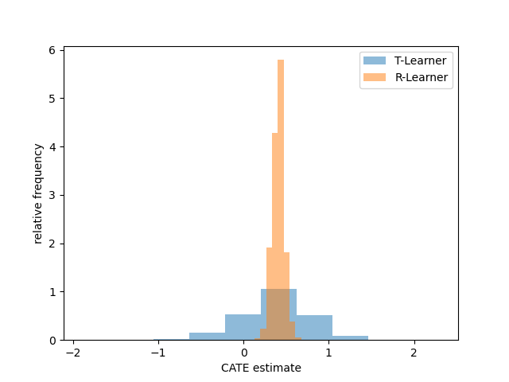

==============================================
 Example: Estimating CATEs with a MetaLearner
==============================================

Loading the data
----------------

First, we will load and prepare some data for this example. In this
particular case we rely on the so-called mindset data set, taken from
`here <https://github.com/matheusfacure/python-causality-handbook/blob/master/causal-inference-for-the-brave-and-true/data/learning_mindset.csv>`_
and under MIT License. It stems from an experimental setup where

* The outcome was the achievement of a student in scalar form, found
  in column ``"achievement_score".``
* The mindset intervention is a binary variable found in the column
  ``"intervention"``.
* Both numerical and categorical covariates/features are present.

.. code-block:: python

   import pandas as pd
   from pathlib import Path
   from git_root import git_root

   df = pd.read_csv(git_root("data/learning_mindset.zip"))
   outcome_column = "achievement_score"
   treatment_column = "intervention"
   feature_columns = [
       column
       for column in df.columns
       if column not in [outcome_column, treatment_column]
   ]
   categorical_feature_columns = [
       "ethnicity",
       "gender",
       "frst_in_family",   # spellchecker:disable-line
       "school_urbanicity",
       "schoolid",
   ]
   # Note that explicitly setting the dtype of these features to category
   # allows both lightgbm as well as shap plots to
   # 1. Operate on features which are not of type int, bool or float
   # 2. Correctly interpret categoricals with int values to be
   #    interpreted as categoricals, as compared to ordinals/numericals.
   for categorical_feature_column in categorical_feature_columns:
       df[categorical_feature_column] = df[categorical_feature_column].astype(
           "category"
       )

Using a first, simple MetaLearner
---------------------------------

Now that the data has been loaded, we can get to actually using
MetaLearners. Let's start with the
:class:`metalearners.TLearner`.
Investigating its documentation, we realize that only three initialization parameters
are necessary: ``nuisance_model_factory``, ``is_classification`` and
``n_variants``. Given that our outcome is a scalar, we want to set
``is_classification=False`` and use a regressor as the
``nuisance_model_factory``. In this case we arbitrarily choose a
regressor from ``lightgbm``. Since we know that the intervention was
binary, we set ``n_variants=2``.

.. code-block:: python

  from metalearners import TLearner
  from lightgbm import LGBMRegressor

  tlearner = TLearner(
      nuisance_model_factory=LGBMRegressor,
      is_classification=False,
      n_variants=2,
  )

Once our T-Learner has been instantiated, we can use it
in a fashion akin to scikit-learn's Estimator protocol. The subtle differences
to aforementioned scikit-learn protocol are that

* We need to specify the observed treatment assignment ``w`` in the call to the
  ``fit`` method.
* We need to specify whether we want in-sample or out-of-sample
  estimates in the ``predict`` call via ``is_oos``.

 .. code-block:: python

  tlearner.fit(
      X=df[feature_columns],
      y=df[outcome_column],
      w=df[treatment_column],
  )

  cate_estimates_tlearner = tlearner.predict(
      X=df[feature_columns],
      is_oos=False,
  )

We can now notice that ``cate_estimates_tlearner`` is of shape
:math:`(n_{obs}, n_{variants} - 1, n_{outputs})`. This is meant to
cater to a general case, where there are more than two variants and/or
classification problems with many class probabilities. Given that we
care about the simple case of binary variant regression, we can make use of
:func:`metalearners.utils.simplify_output` to simplify this shape as such:

.. code-block:: python

  from metalearners.utils import simplify_output
  one_d_estimates = simplify_output(cate_estimates_tlearner)

  print(cate_estimates_tlearner.shape)
  print(one_d_estimates.shape)

which will lead to the output

.. code-block::

 (10391, 1, 1)
 (10391,)

Using a MetaLearner with two stages
-----------------------------------

Instead of using a T-Learner, we can of course also some other
MetaLearner, such as the :class:`metalearners.RLearner`.
The R-Learner's documentation tells us that two more instantiation
parameters are necessary: ``propensity_model_factory`` and
``treatment_model_factory``. Hence we can instantiate an R-Learner as follows

.. code-block:: python

  from metalearners import RLearner
  from lightgbm import LGBMClassifier
  rlearner = RLearner(
      nuisance_model_factory=LGBMRegressor,
      propensity_model_factory=LGBMClassifier,
      treatment_model_factory=LGBMRegressor,
      is_classification=False,
      n_variants=2,
  )

where we choose a classifier class to serve as a blueprint for our
eventual propensity model.

If we want to make sure these models are initialized in a specific
way, e.g. with a specific value for the hyperparameter ``n_estimators``, we can do that
as follows:

.. code-block:: python

  rlearner = RLearner(
      nuisance_model_factory=LGBMRegressor,
      propensity_model_factory=LGBMClassifier,
      treatment_model_factory=LGBMRegressor,
      is_classification=False,
      n_variants=2,
      nuisance_model_params={"n_estimators": 10},
      propensity_model_params={"n_estimators": 8},
      treatment_model_params={"n_estimators": 3},
  )

The estimation steps look identical to those of the T-Learner:

.. code-block:: python

  rlearner.fit(
      X=df[feature_columns],
      y=df[outcome_column],
      w=df[treatment_column],
  )

  cate_estimates_rlearner = rlearner.predict(
      X=df[feature_columns],
      is_oos=False,
  )

Comparing estimates
-------------------

We can now compare the CATE estimates produced by both MetaLearners on
a histogram:

.. code-block:: python

   import matplotlib.pyplot as plt

   fig, ax = plt.subplots()

   ax.hist(simplify_output(cate_estimates_tlearner), density=True, alpha=.5, label="T-Learner")
   ax.hist(simplify_output(cate_estimates_rlearner), density=True, alpha=.5, label="R-Learner")
   ax.legend()
   ax.set_xlabel("CATE estimate")
   ax.set_ylabel("relative frequency")

Leaving us with the following plot:

