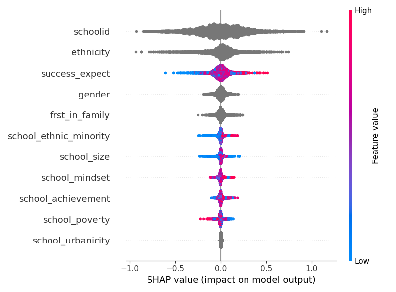
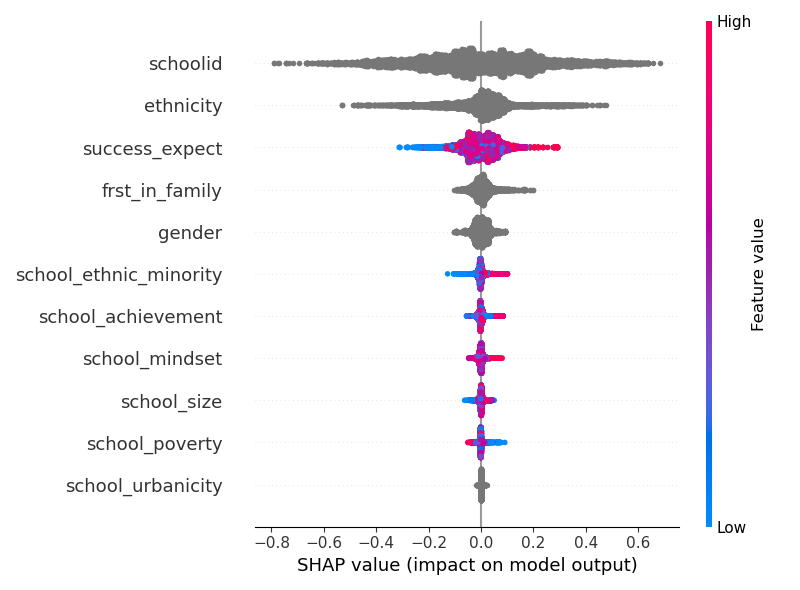
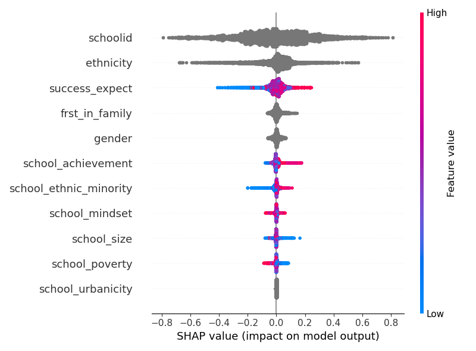

Example: Feature importance and SHAP values
===================================================================

Motivation
----------

As stated in the :ref:`example on LIME explainability <example-lime>`, LIME is a *local*
explainability method. This means that LIME focuses on one sample -- or its
locality/vicinity/neighborhood -- at a time and tries to imitate the
true model behaviour around that sample with a simpler model.

On the other hand, SHAP -- short for *SHapley Additive exPlanations* -- is another popular
method for interpretability which can provide both local and global interpretations. It
uses a cooperative game theory approach to estimate the impact of each feature on the prediction.
Local interpretation in SHAP refers to the explanation for a specific prediction made for
an individual instance in your dataset. In addition, global interpretation can be achieved
in a holistic way by analyzing the importance of each feature across the entire dataset.

Lastly, feature importance computation is another widely-used method for global interpretability.
While it may not be applicable to all types of models, most tree-based models—including
decision trees, random forests, and gradient boosting machines—come with built-in mechanisms
for calculating feature importance. This approach ranks the features based on their
contributions to the model, providing an overarching view of what features predominantly
drive the model's decision-making process.

While SHAP and feature importance are typically used in supervised learning scenarios, the key
motivation of better understanding a model's behaviour applies just as well to CATE
estimation. However, in the context of MetaLearners when compared to the traditional supervised setting,
there's a notable challenge. Some MetaLearners, such as the :class:`~metalearners.SLearner`,
:class:`~metalearners.TLearner` and :class:`~metalearners.XLearner`, do not possess a direct
CATE prediction model. Conversely, others like the :class:`~metalearners.RLearner` and
:class:`~metalearners.DRLearner` have a dedicated second stage model which directly estimates the CATE.
Given these varied scenarios, we provide examples for both situations in the subsequent sections.
Therefore, we illustrate how it can be used with the MetaLearners from ``metalearners``.

Background
----------

Feature importance
""""""""""""""""""

Most tree-based estimators compute feature importances while fitting, see
`here <https://scikit-learn.org/stable/auto_examples/ensemble/plot_forest_importances.html>`_ and
the ``importance_type`` attribute from `LGBMRegressor <https://lightgbm.readthedocs.io/en/latest/pythonapi/lightgbm.LGBMRegressor.html#lightgbm.LGBMRegressor>`_
or `XGBRegressor <https://xgboost.readthedocs.io/en/stable/python/python_api.html#xgboost.XGBRegressor>`_.

These feature importance measures present valuable insights into the impact of each feature
on the CATE estimation.

It is important to note that there are different methods of computing the feature importances,
for example `LGBMRegressor <https://lightgbm.readthedocs.io/en/latest/pythonapi/lightgbm.LGBMRegressor.html#lightgbm.LGBMRegressor>`_
allows to pass ``importance_type="split"`` or ``importance_type="gain"``. In the former
feature importances are computed as the number of times the feature is used to split a tree
and in the latter the total gain of the splits which use the feature is used. This can affect
the results and depending on the use case one may be better than the other.

SHAP values
""""""""""""

SHAP is a method developed by `Lundberg et al. (2017) <https://www.arxiv.org/abs/1705.07874>`_.
SHAP values base their approach on the Shapley value, a concept derived from cooperative
game theory. This concept assigns a payout to each player contributing to a cooperative
game, depending on their contribution to the total payout. Translated into the realm of
machine learning, a *game* is the prediction task, *players* are the features, and the
*payout* becomes the prediction.

A positive factor of the SHAP values is their desirable properties which come from their
theoretical foundation in cooperative game theory. These properties include:

* **Local accuracy**: Ensures that the local contribution of the features adds up to the
  to the difference of prediction for :math:`x` and the average.
* **Missingness**: Ensures that the missing features do not have an impact on the prediction.
* **Consistency**: States that if a model changes so that the marginal contribution of
  a feature value increases or stays the same (regardless of other features), the Shapley
  value also increases or stays the same.

Much like the Shapley values that inspired them, computing SHAP values has a high computational
cost. Each possible subset of features needs to be considered to calculate exact SHAP
values, which leads to an exponential increase in computation with the number of features.
However, techniques like Kernel SHAP and Tree SHAP have been developed, which can approximate
SHAP values efficiently even over thousands of features.

Usage
-----

Loading the data
""""""""""""""""

Just like in our :ref:`example on estimating CATEs with a MetaLearner <example-basic>`,
we will first load some experiment data:

.. code-block:: python

   import pandas as pd
   from pathlib import Path
   from git_root import git_root
   df = pd.read_csv(git_root("data/learning_mindset.zip"))
   outcome_column = "achievement_score"
   treatment_column = "intervention"
   feature_columns = [
       column
       for column in df.columns
       if column not in [outcome_column, treatment_column]
   ]
   categorical_feature_columns = [
       "ethnicity",
       "gender",
       "frst_in_family",   # spellchecker:disable-line
       "school_urbanicity",
       "schoolid",
   ]
   # Note that explicitly setting the dtype of these features to category
   # allows both lightgbm as well as shap plots to
   # 1. Operate on features which are not of type int, bool or float
   # 2. Correctly interpret categoricals with int values to be
   #    interpreted as categoricals, as compared to ordinals/numericals.
   for categorical_feature_column in categorical_feature_columns:
       df[categorical_feature_column] = df[categorical_feature_column].astype(
           "category"
       )

Now that we've loaded the experiment data, we can train a couple of MetaLearners.

Training MetaLearners
""""""""""""""""""""""

Again, mirroring our :ref:`example on estimating CATEs with a MetaLearner <example-basic>`,
we can train an :class:`~metalearners.rlearner.RLearner` as follows:

.. code-block:: python

  from metalearners import RLearner
  from lightgbm import LGBMRegressor, LGBMClassifier
  rlearner = RLearner(
      nuisance_model_factory=LGBMRegressor,
      propensity_model_factory=LGBMClassifier,
      treatment_model_factory=LGBMRegressor,
      is_classification=False,
      n_variants=2,
  )
  rlearner.fit(
      X=df[feature_columns],
      y=df[outcome_column],
      w=df[treatment_column],
  )

We will also train a :class:`~metalearners.TLearner` to show both scenarios:

.. code-block:: python

  from metalearners import TLearner
  tlearner = TLearner(
      nuisance_model_factory=LGBMRegressor,
      is_classification=False,
      n_variants=2,
  )
  tlearner.fit(
      X=df[feature_columns],
      y=df[outcome_column],
      w=df[treatment_column],
  )

Creating an :class:`~metalearners.explainer.Explainer` object
""""""""""""""""""""""""""""""""""""""""""""""""""""""""""""""

Now we can need to create an :class:`~metalearners.explainer.Explainer` object which will
allow us to compute the feature importance and the SHAP values.

This step is the key difference between the models which have a unique treatment model for
each variant and the ones that do not.

The MetaLearner has a unique treatment model for each variant
#############################################################

In our trained RLearner the treatment model is a ``LGBMRegressor``, this computes feature
importances and can be used for SHAP values calculations, therefore we can directly use
it as the model to interpret. We can get an :class:`~metalearners.explainer.Explainer`
which uses the final stage models with the following code:

.. code-block:: python

    rlearner_explainer = rlearner.explainer()

The MetaLearner does not have a unique treatment model for each variant
#######################################################################

In the scenario where the MetaLearner does not have a unique treatment model for each
variant, the proposed solution is to fit an interpretable model for each treatment variant.
The input for these models will be the same covariates, while the output is the estimated CATE
by the MetaLearner. For this we can use the same method as before
:meth:`~metalearners.metalearner.MetaLearner.explainer` but passing also the ``X``,
``cate_estimates`` and ``cate_model_factory`` parameters:

.. code-block:: python

    tlearner_explainer = tlearner.explainer(
        X=df[feature_columns],
        cate_estimates=tlearner.predict(X=df[feature_columns], is_oos=False),
        cate_model_factory=LGBMRegressor,
    )

It is important to note that this method works for every MetaLearner as we can always retrain
new models to interpret, for example with the previously trained RLearner:

.. code-block:: python

    rlearner_explainer_from_estimates = rlearner.explainer(
        X=df[feature_columns],
        cate_estimates=rlearner.predict(X=df[feature_columns], is_oos=False),
        cate_model_factory=LGBMRegressor,
    )

Computing the feature importance
""""""""""""""""""""""""""""""""

Now we can compute the feature importances:

.. code-block:: python

    print(rlearner_explainer.feature_importances(feature_names=feature_columns, sort_values=True)[0])
    print(tlearner_explainer.feature_importances(feature_names=feature_columns, sort_values=True)[0])
    print(rlearner_explainer_from_estimates.feature_importances(feature_names=feature_columns, sort_values=True)[0])

Which returns the following output:

.. code-block:: python

    success_expect            575
    schoolid                  507
    ethnicity                 319
    gender                    257
    school_size               246
    school_ethnic_minority    232
    school_poverty            229
    school_mindset            227
    school_achievement        209
    frst_in_family            197   # spellchecker:disable-line
    school_urbanicity           2
    dtype: int32

    schoolid                  849
    success_expect            533
    ethnicity                 417
    school_ethnic_minority    207
    school_mindset            192
    gender                    181
    frst_in_family            171   # spellchecker:disable-line
    school_achievement        165
    school_size               152
    school_poverty            127
    school_urbanicity           6
    dtype: int32

    schoolid                  833
    ethnicity                 487
    success_expect            463
    school_ethnic_minority    209
    school_mindset            200
    school_achievement        178
    frst_in_family            162   # spellchecker:disable-line
    school_size               161
    school_poverty            160
    gender                    140
    school_urbanicity           7
    dtype: int32

Note that the method :meth:`~metalearners.explainer.Explainer.feature_importances`
returns a list of length :math:`n_{variats} -1` that indicates the feature importance for
each variant against control.

Computing and plotting the SHAP values
""""""""""""""""""""""""""""""""""""""

We can compute the SHAP values with the corresponding calls to :meth:`~metalearners.explainer.Explainer.shap_values`
with the desired ``shap_explainer_factory``, in our case as we are are always interpreting
``LGBMRegressor`` models we will use `TreeExplainer <https://shap.readthedocs.io/en/latest/generated/shap.TreeExplainer.html>`_:

.. code-block:: python

    from shap import TreeExplainer, summary_plot

    shap_values_rlearner = rlearner_explainer.shap_values(
        X=df[feature_columns], shap_explainer_factory=TreeExplainer
    )
    summary_plot(shap_values_rlearner[0], features=df[feature_columns])

    shap_values_tlearner = tlearner_explainer.shap_values(
        X=df[feature_columns], shap_explainer_factory=TreeExplainer
    )
    summary_plot(shap_values_tlearner[0], features=df[feature_columns])

    shap_values_rlearner_from_estimates = rlearner_explainer_from_estimates.shap_values(
        X=df[feature_columns], shap_explainer_factory=TreeExplainer
    )
    summary_plot(shap_values_rlearner_from_estimates[0], features=df[feature_columns])

Which shows the following images:

For guidelines on how to interpret such SHAP plots please see the `SHAP documentation <https://github.com/shap/shap>`_.

Note that the method :meth:`~metalearners.explainer.Explainer.shap_values`
returns a list of length :math:`n_{variats} -1` that indicates the SHAP values for
each variant against control.

Further comments
""""""""""""""""

* In the scenario where the model has a unique treatment model for each variant and the used
  base model does not compute ``feature_importances_``, the :class:`~metalearners.explainer.Explainer`
  object will raise an error when calling :meth:`~metalearners.explainer.Explainer.feature_importances`.
  In that case, it is required to retrain a model which computes ``feature_importances_``
  by passing ``X``, ``cate_estimates`` and a compatible ``cate_model_factory`` to
  :meth:`~metalearners.MetaLearner.explainer`.
