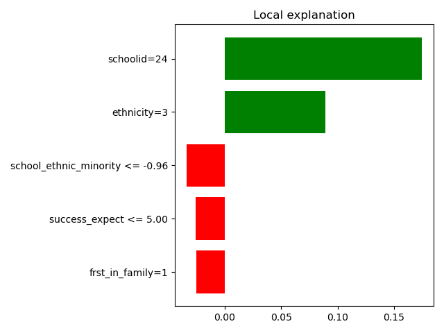
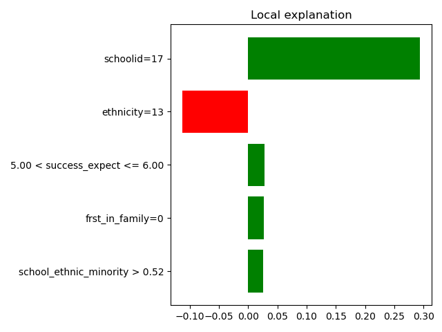

.. _example-lime :

====================================================
 Example: Explainability LIME plots for MetaLearners
====================================================

Motivation
----------

LIME -- short for *local interpretable model-agnostic explanations* -- is a method developed by `Ribeiro et al. (2016)
<https://arxiv.org/abs/1602.04938>`_. LIME falls under the umbrella
term of explainability methods in Machine Learning. On a high level,
it is meant to serve the purpose of providing explanations, intuitions
or examples as to how a model or estimator works.

The authors argue that

  If the users do not trust a model or prediction, they will not use it.

While LIME is typically used in supervised learning scenarios, the key
motivation of better understanding a model's behaviour applies just as
well to CATE estimation. Therefore, we illustrate how it can be used
with the MetaLearner from ``metalearners``.

Background
----------

As the name suggests, LIME is model-agnostic and can be used for any
black-box model which receives features or covariates and maps those
to a one-dimension vector of equal number of rows.

As the name also suggests, the explanations provided by LIME are
local. The authors state the following:

  [...] for an explanation to be meaningful it must at least be locally faithful, i.e. must correspond to how the model behaves in the vicinity of the instance being predicted.

Concretely, this means that LIME focuses on one sample -- or its
locality/vicinity/neighborhood -- at a time and tries to imitate the
true model behaviour around that sample with a simpler model.

In other words, LIME's objective is to choose a substitute model for
our complex model, simulaneously considering two concerns:

* the interpretability of our new, simple model (let's call this surrogate)
* the approximation error between the surrogate and the original,
  complex model

More formally, the authors define:

* :math:`f`, the original model -- in our case the MetaLearner
* :math:`G`, the class of possible, interpretable surrogate models
* :math:`\Omega(g)`, a measure of complexity for :math:`g \in G`
* :math:`\pi_x(z)` a proximity measure of :math:`z` with respect to data point :math:`x`
* :math:`\mathcal{L}(f, g, \pi_x)` a measure of how unfaithful a :math:`g \in G` is to :math:`f` in the locality defined by :math:`\pi_x`

Given all of these objects as well as a to be explained data point :math:`x`, the authors suggest that the most appropriate surrogate :math:`g`, also referred to as explanation for :math:`x`, :math:`\xi(x)`, can be expressed as follows:

.. math ::

  \xi(x) = argmin_{g' \in G} \mathcal{L}(f, g', \pi_x) + \Omega(g')

The authors suggest a mechanisms to optimize this problem, i.e. to
find suitable local explanations.

Moreover, they suggest a systematic approach to selecting a set of samples, as for
their respective local explanations to be as telling of the overall model
behaviour as possible. Intuitively, the authors suggest to select a pool of explanations which

* have little redundancy between each other
* showcase the features with highest global importance

In line with this ambition, they define a notion of 'coverage' -- to
be maximized --as follows:

.. math ::

  c(V, W, \mathcal{I}) = \sum_{j=1}^{d} I[\exists i \in V: W_{i,j} > 0] \mathcal{I}_j

where

* :math:`d` is the number of features
* :math:`V` is the candidate set of explanations to be shown to
  humans, within a fixed budget -- this is the variable to be optimized
* :math:`W` is a :math:`n \times d` local feature importance matrix and
* :math:`\mathcal{I}` is a :math:`d`-dimensional vector of global
  feature importances

Implicitly, the authors suppose that local model :math:`\xi(x_i)` has a
canonical way of determining feature importances for :math:`W` --
e.g. weights in a linear model --
and that a global model :math:`f` does so, too, for
:math:`\mathcal{I}`.

Picking data points to optimize this notion of coverage is reflected
in ``lime``'s ``SubmodularPick`` class, which we use below.

Installation
------------

In order to generate LIME plots, we first need to install the `lime
package <https://github.com/marcotcr/lime>`_. We can do so either via
conda and conda-forge

.. code-block:: console

   $ conda install lime -c conda-forge

or via pip and PyPI

.. code-block:: console

   $ pip install lime

Usage
-----

Loading the data
""""""""""""""""

Just like in our :ref:`example on estimating CATEs with a MetaLearner
<example-basic>`, we will first load some experiment data:

.. code-block:: python

   import pandas as pd
   from pathlib import Path
   from git_root import git_root

   df = pd.read_csv(git_root("data/learning_mindset.zip"))
   outcome_column = "achievement_score"
   treatment_column = "intervention"
   feature_columns = [
       column
       for column in df.columns
       if column not in [outcome_column, treatment_column]
   ]
   categorical_feature_columns = [
       "ethnicity",
       "gender",
       "frst_in_family",   # spellchecker:disable-line
       "school_urbanicity",
       "schoolid",
   ]
   # Note that explicitly setting the dtype of these features to category
   # allows both lightgbm as well as shap plots to
   # 1. Operate on features which are not of type int, bool or float
   # 2. Correctly interpret categoricals with int values to be
   #    interpreted as categoricals, as compared to ordinals/numericals.
   for categorical_feature_column in categorical_feature_columns:
       df[categorical_feature_column] = df[categorical_feature_column].astype(
           "category"
       )

Now that we've loaded the experiment data, we can train a MetaLearner.

Training a MetaLearner
""""""""""""""""""""""

Again, mirroring our :ref:`example on estimating CATEs with a MetaLearner
<example-basic>`, we can train an
:class:`~metalearners.rlearner.RLearner` as follows:

.. code-block:: python

  from metalearners import RLearner
  from lightgbm import LGBMRegressor, LGBMClassifier

  rlearner = RLearner(
      nuisance_model_factory=LGBMRegressor,
      propensity_model_factory=LGBMClassifier,
      treatment_model_factory=LGBMRegressor,
      is_classification=False,
      n_variants=2,
  )

  rlearner.fit(
      X=df[feature_columns],
      y=df[outcome_column],
      w=df[treatment_column],
  )

Generating lime plots
"""""""""""""""""""""

``lime`` will an expect a function which takes in an ``X`` and returns
a one-dimensional vector of the same length as ``X``. We'll have to
adapt the :meth:`~metalearners.rlearner.RLearner.predict` method of
our :class:`~metalearners.rlearner.RLearner` in two ways:

* We need to pass a value for the necessary parameter ``is_oos`` to :meth:`~metalearners.rlearner.RLearner.predict`.

* We need to reshape the output of
  :meth:`~metalearners.rlearner.RLearner.predict` to be one-dimensional. This
  we can easily achieve via :func:`metalearners.utils.simplify_output`.

This we can do as follows:

.. code-block:: python

  from metalearners.utils import simplify_output

  def predict(X):
      return simplify_output(rlearner.predict(X, is_oos=True))

where we set ``is_oos=True`` since ``lime`` will call
:meth:`~metalearners.rlearner.RLearner.predict`
with various inputs which will not be able to be recognized as
in-sample data.

Since ``lime`` expects ``numpy`` datastructures, we'll have to
manually encode the categorical features of our ``pandas`` data
structure, see `this issue <https://github.com/microsoft/LightGBM/issues/5162>`_ for more context.

.. code-block:: python

  X = df[feature_columns].copy()
  for categorical_feature_column in categorical_feature_columns:
      X[categorical_feature_column] = X[categorical_feature_column].cat.codes

Moreover, we need to manually prepare the mapping of categorical codes
to categorical values as well as the indices of categorical features:

.. code-block:: python

  categorical_names = []
  for i, column in enumerate(feature_columns):
      categorical_names.append([])
      if column in categorical_feature_columns:
          categorical_names[i] = list(df[column].cat.categories)

  categorical_feature_indices = [
      i for i, name in enumerate(feature_columns) if name in categorical_feature_columns
  ]

We can now create the necessary ``lime`` objects:
``LimeTabularExplainer`` to explain a sample at hand as
well as ``SubmodularPick``, choosing samples for us to be
locally explained.

.. code-block:: python

   from lime.lime_tabular import LimeTabularExplainer
   from lime.submodular_pick import SubmodularPick

   explainer = LimeTabularExplainer(
       X,
       feature_names=feature_columns,
       categorical_features=categorical_feature_indices,
       categorical_names=categorical_names,
       verbose=False,
       mode="regression",
       discretize_continuous=True,
   )

   sp = SubmodularPick(
       data=X,
       explainer=explainer,
       predict_fn=predict,
       method="sample",
       sample_size=1_000,
       num_exps_desired=3,
       num_features=5,
   )

   figures = [explanation.as_pyplot_figure() for explanation in sp.sp_explanations]

   for figure in figures:
      figure.show()

In the following we can see the three explanations which have been chosen. We find the
most locally most relevant features on the vertical axis and the
outcome dimension on the horizontal axis.

.. image:: imgs/lime_2.png
  :width: 600
  :alt: Explanation 3
  :align: center

For guidelines on how to interpret such lime plots please see the `lime documentation <https://github.com/marcotcr/lime>`_.
